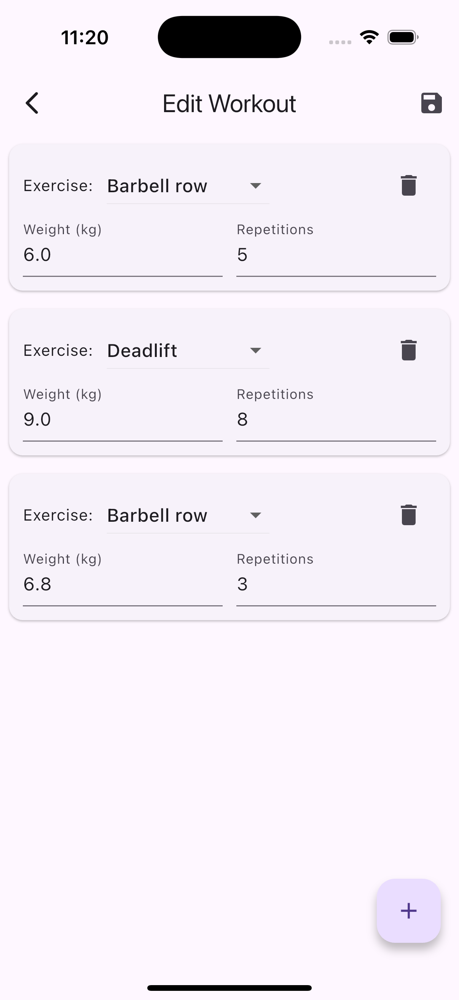
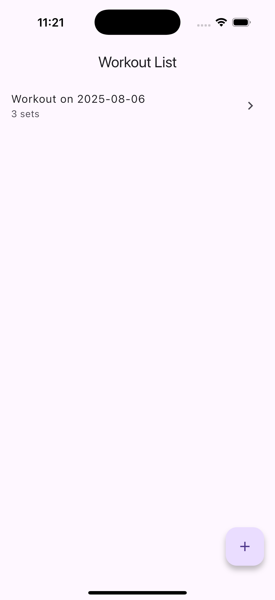

A simple app built using **Flutter** as part of a technical test.

## Preview 
<table>
   <tr>
      <td>
         
      </td>
      <td>
         
      </td>
   </tr>
</table>

## Features
- Add and edit workout sessions
- Each workout contains one or more sets
- Each set includes: Exercise name, Weight used, Number of repetitions
- View a list of all workouts
- Edit or delete existing workouts
- In-memory data storage (no database)
- Form validation
- Unit, widget, and integration testing

## Architecture
I used the **MVVM (Model–View–ViewModel)** architecture to keep the code clean and easy to maintain.

## State Management
I used **Riverpod** for managing app-wide state.

**Why Riverpod?**
- Doesn’t require `BuildContext` to read or write state, Makes testing simple, Clean and modular, Scales well as the app grows

**How I used it**
- `StateNotifierProvider` manages the list of workouts globally
- `setState()` is only used for temporary, local form state inside the `WorkoutScreen`

This balance avoids overengineering while keeping state predictable and clean.

## Third-Party Packages
**Package - Why I used it**
- `flutter_riverpod` - For state management
- `uuid` - To generate unique workout IDs

I didn’t use persistent storage like Hive or SharedPreferencesas, the task requirements did not explicitly specify the need for data persistence. 

## Testing
I added different types of tests:

**Unit Tests**
- Test workout logic like adding, editing, deleting

**Widget Tests**
- Check if the UI updates correctly

**Integration Tests**
- Simulate user flow from adding to editing workouts

All tests use `flutter_test`. I kept the test coverage focused on the main functionality.

## Navigation
I used Flutter’s built-in `Navigator.push()` for moving between screens.
Since the app only has two screens and doesn’t need deep linking, using a routing package like GoRouter or AutoRoute would have been unnecessary.

## Reusability
I created a reusable widget `WorkoutSetCard` for rendering each workout set.
This keeps the UI consistent and modular, and makes future updates easier.

## How to Run
1. Clone the repo
   ```bash
   git clone https://github.com/mahesh311094/magic_ai_task.git
   cd workout-tracker
   ```
2. Get the dependencies
   ```bash
   flutter pub get
   ```
3. Run the app
   ```bash
   flutter run
   ```
4. Run the tests
   ```bash
   flutter test
   ```
## Final Note
This app was built with a focus on:
- Clean and testable architecture (MVVM)
- Practical use of state management (Riverpod)
- Simple and intuitive UI
- Code readability, reusability and well commented

Thanks for reviewing!